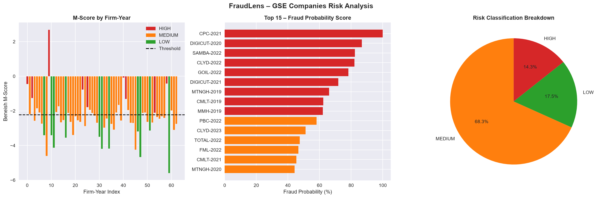

# FraudLens 🔍

**AI-Assisted Financial Statement Fraud Detection Pipeline**

FraudLens is a Python-based fraud detection pipeline that analyses financial statements using the Beneish M-Score model, Z-score anomaly detection, and Isolation Forest machine learning to identify firms at risk of earnings manipulation.

Built as a portfolio project by a forensic accounting practitioner — combining financial crime investigation experience with data science.

---

## What It Does

FraudLens takes company financial data and outputs:

- **Beneish M-Score** across all 8 indices (DSRI, GMI, AQI, SGI, DEPI, SGAI, LVGI, TATA)
- **Z-score anomaly flags** on key financial ratios
- **Isolation Forest** machine learning fraud signals
- **Composite fraud probability score** (0–100%) per firm-year
- **Risk classification**: HIGH / MEDIUM / LOW
- **Plain-English interpretations** of each company's results
- **Automated PDF report** with executive summary, risk table, and findings

---

## Demo Results — Ghana Stock Exchange (GSE)

Applied to 21 GSE-listed companies covering 2019–2023 (88 firm-year observations):

| Risk Level | Count | %     |
| ---------- | ----- | ----- |
| HIGH       | 9     | 14.3% |
| MEDIUM     | 43    | 68.3% |
| LOW        | 11    | 17.5% |

**Top finding:** Cocoa Processing Company (CPC) recorded a fraud probability of 100% in 2021, with an M-Score of +2.69 — confirmed by all three detection methods.



---

## Project Structure

FraudLens/
│
├── notebooks/
│ ├── fraudlens_pipeline.ipynb # v1.0 — synthetic data demo
│ └── fraudlens_v2.ipynb # v2.0 — real CSV and GSE data
│
├── data/
│ ├── fraudlens_template.csv # Template for your own data
│ └── GSE_data.xlsx # Ghana Stock Exchange financials
│
└── output/
├── FraudLens_GSE_Report.pdf # Full PDF report
└── fraudlens_gse_charts.png # Risk visualisations

---

## How to Use

### Option 1 — Run on your own data

1. Fill in `data/fraudlens_template.csv` with your company financials
2. Open `notebooks/fraudlens_v2.ipynb` in VS Code or Jupyter
3. Run all cells — the pipeline will score and report your companies

### Option 2 — Explore the GSE demo

1. Open `notebooks/fraudlens_v2.ipynb`
2. Run from the GSE data loader cell onwards
3. A PDF report is generated automatically in `output/`

---

## Requirements

```bash
pip install pandas numpy scikit-learn matplotlib seaborn reportlab openpyxl scipy
```

---

## Methodology

The Beneish M-Score (1999) uses eight financial ratios to detect earnings manipulation:

| Index | What It Measures                                                  |
| ----- | ----------------------------------------------------------------- |
| DSRI  | Days Sales in Receivables — receivables growing faster than sales |
| GMI   | Gross Margin — deteriorating margins                              |
| AQI   | Asset Quality — increase in non-current, non-physical assets      |
| SGI   | Sales Growth — aggressive revenue growth                          |
| DEPI  | Depreciation — slowing depreciation rate                          |
| SGAI  | SG&A Expenses — rising overhead relative to sales                 |
| LVGI  | Leverage — increasing debt burden                                 |
| TATA  | Total Accruals — high accruals relative to assets                 |

**Threshold:** M-Score > -2.22 suggests possible earnings manipulation.

FraudLens combines this with Z-score outlier detection and Isolation Forest (an unsupervised ML algorithm) to produce a robust composite risk score.

---

## Limitations

- The M-Score is a probabilistic model, not a definitive fraud indicator
- High scores in legitimate growth phases (e.g. capital expansion) can mimic fraud signals
- Results should always be interpreted alongside qualitative analysis and professional judgment
- This tool is for academic and research purposes only

---

## Author

**Theophilus Abayayateye**
MSc Forensic Accounting and Fraud Examination | Ghana Police Service
[GitHub](https://github.com/Theo-abaya/FraudLens)

---

_FraudLens is an academic portfolio project and does not constitute a finding of fraud or legal violation against any company._
